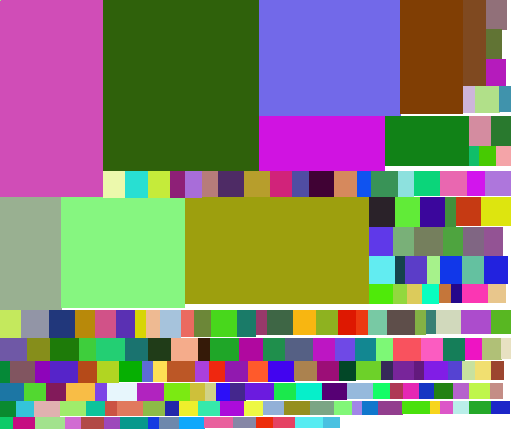

# quadrekt

> Pack rectangles to rectangle in asynchronous manner



## Install

```
npm i quadrekt
```

## Usage

```js

const quadrekt = require("quadrekt");

quadrekt([
    {width: 200, height: 100, data: 1},
    {width: 150, height: 60, data: 2},
    {width: 80, height: 40, data: 3}
]).then(result => {
    let { totalWidth, totalHeight, rects } = result;
    
    rects.forEach(rect => console.log(rect.x, rect.y, rect.data));
})

```

## API

### quadrekt(rects, [options])

#### rects

Type: `Object[]`

Array of objects representing rectangles to be packed. Each object should include `width`, `height` and (optionally) `data` properties. `data` property will be included in resulting array of packed rects.

#### options

Type `Object`

Possible options: 
* `maxWidth` — width of target rectangle (to which other rects will be packed) (default: 2048)
* `rectsPerTick` — amount of rectangles to pack during one tick (default: 50)


## TODO

* Add unit tests